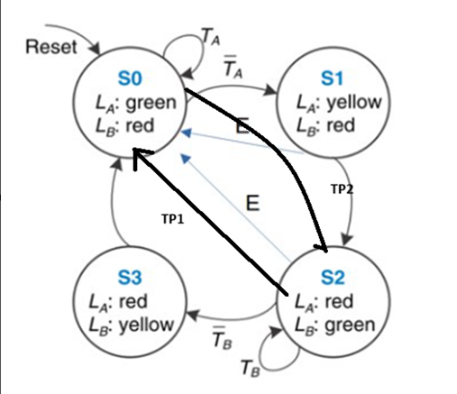
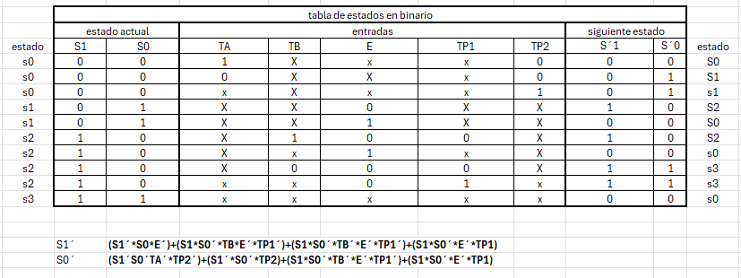
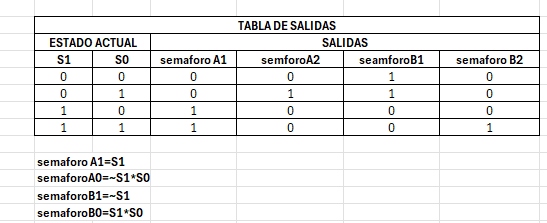
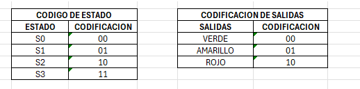
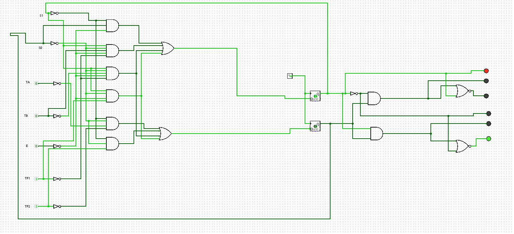
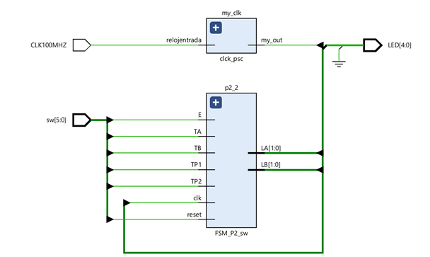
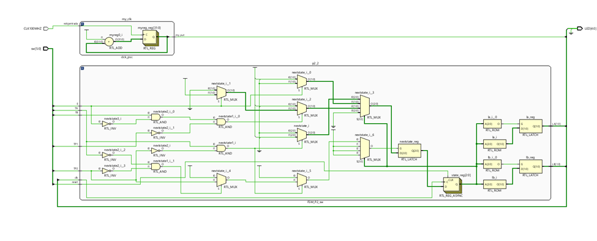
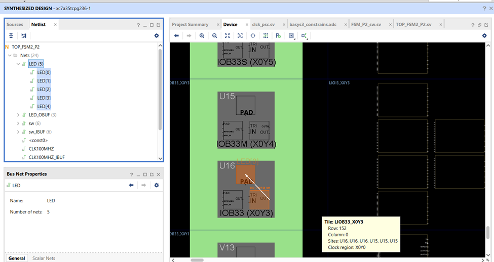
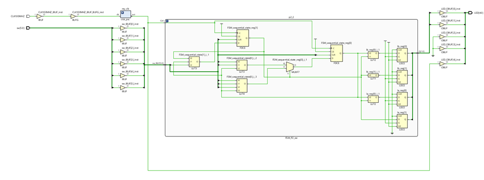

# entregable-serie-1-y-2
# simulacion logisim y tablas
En este parcial se realizo un semaforo de dos vias junto con una caracteristica especial , esta caracteristica especial consiste en un detector de transporte publico.

 

Entonces la caracteristica especial que se agrego es la de detector de transporte publico , esta funciona de la siguiente manera: si se tiene en una de las vias el semaforo en verde pero en la via contraria se detecta que ha llegado algun bus entonces se priorizara dicha via donde esta el transporte publico, dando el semaforo en verde y cambiando a rojo el otro semaforo.

Al tener ya las condiciones se procedio a hacer el diagrama de estados y luego a se obtuvieron las tablas de verdad que son las siguintes : Tabla de estados , tabla de salidas. Codificando igualmente los colores del semaforo para poder ser representados con dos bits.

# diagrama simulacion logisim

# Vivado

los archivos del proyecto se encuentran en la carpeta FSM.

El codigo de la programacion del proyecto consta de tres partes: TOP_FSM2_P2 , clck_psc y FSM_PS2_sw.

EL TOP_FSM2_P2 se mandan a llamar como instacias clck_psc y FSM_PS2_sw, en esta parte del top tambien se declararon cuantas entradas se van a tener y cuantas salidas.

En la parte del clck se utilizo el clck de 100Mhz que tiene la placa bassys3 para generar los pulsos necesarios para generar las secuencias. 

y en la parte de  FSM_PS2_sw se realizo toda la programacion del semaforo , basado en las tablas de estados y las tablas de salidas que se hicieron con anterioridad.

# pasos del develoment flow

# RTL analisys 

en esta parte se asegura de que cumpla con todas las restricciones y requisitos correctamente. Además, se realiza un esquemático del sistema descrito en el código, lo que implica representar los diferentes módulos como bloques para una mejor visualización. 

# Synthesis

Durante la síntesis, evaluamos si nuestro dispositivo tiene la capacidad de ejecutar la función descrita en nuestro código utilizando sus componentes. En el caso específico de la Basys3, se destacan ciertas partes del dispositivo que serán utilizadas para ejecutar el código.

