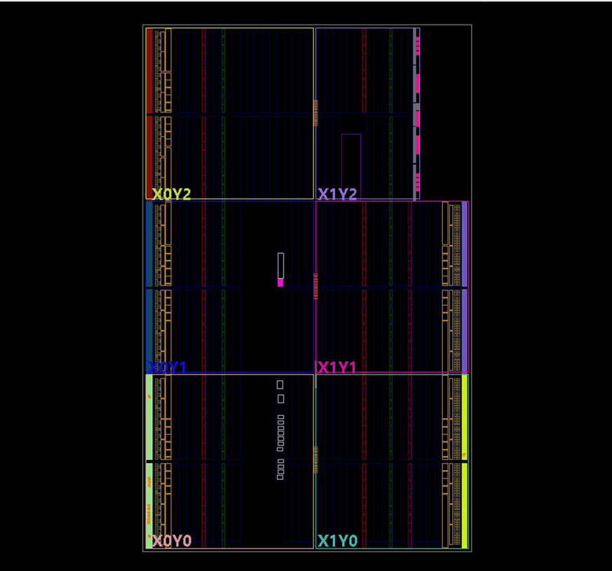

# entregable-serie-1-y-2
# simulacion logisim y tablas
En este parcial se realizo un semaforo de dos vias junto con una caracteristica especial , esta caracteristica especial consiste en un detector de transporte publico.

 

Entonces la caracteristica especial que se agrego es la de detector de transporte publico , esta funciona de la siguiente manera: si se tiene en una de las vias el semaforo en verde pero en la via contraria se detecta que ha llegado algun bus entonces se priorizara dicha via donde esta el transporte publico, dando el semaforo en verde y cambiando a rojo el otro semaforo.

Al tener ya las condiciones se procedio a hacer el diagrama de estados y luego a se obtuvieron las tablas de verdad que son las siguintes : Tabla de estados , tabla de salidas. Codificando igualmente los colores del semaforo para poder ser representados con dos bits.

# diagrama simulacion logisim

# Vivado

los archivos del proyecto se encuentran en la carpeta FSM.

El codigo de la programacion del proyecto consta de tres partes: TOP_FSM2_P2 , clck_psc y FSM_PS2_sw.

EL TOP_FSM2_P2 se mandan a llamar como instacias clck_psc y FSM_PS2_sw, en esta parte del top tambien se declararon cuantas entradas se van a tener y cuantas salidas.

En la parte del clck se utilizo el clck de 100Mhz que tiene la placa bassys3 para generar los pulsos necesarios para generar las secuencias. 

y en la parte de  FSM_PS2_sw se realizo toda la programacion del semaforo , basado en las tablas de estados y las tablas de salidas que se hicieron con anterioridad.

# pasos del develoment flow

# RTL analisys 

en esta parte se asegura de que cumpla con todas las restricciones y requisitos correctamente. Además, se realiza un esquemático del sistema descrito en el código, lo que implica representar los diferentes módulos como bloques para una mejor visualización. 

# Synthesis

Durante la síntesis, evaluamos si nuestro dispositivo tiene la capacidad de ejecutar la función descrita en nuestro código utilizando sus componentes. En el caso específico de la Basys3, se destacan ciertas partes del dispositivo que serán utilizadas para ejecutar el código.

# Implementación

En este paso, se muestran las partes específicas que se utilizarán para la implementación, junto con las conexiones relizadas en la fpga.se genera una imagen similar a la de síntesis, pero esta vez resaltando las slice que serán utilizadas.

# Program and Debug

en esta parte se genera el bitstream el cual configura todas las conexiones que se hicieron , respetando la netlist que se creo.Despues de esto ya se puede programar nuestra bassys3.

# Discusion de resultados 
El semáforo implementado ha demostrado un comportamiento adecuado en la regulación del tráfico, alternando entre estados de "verde", "amarillo" y "rojo" de manera fluida y coherente.

La utilización de una FSM ha permitido una gestión eficiente de los estados del semáforo, facilitando su control y garantizando su util funcionamiento.

Se ha evaluado la flexibilidad del sistema para adaptarse a diferentes escenarios y condiciones de tráfico. Se ha demostrado que el diseño es configurable y puede ajustarse fácilmente para satisfacer requisitos específicos, como tiempos de espera o patrones de tráfico variables. 

Los resultados obtenidos en la implementación del semáforo con una máquina de estados finitos en una FPGA son muy buenos, demostrando un funcionamiento eficiente, confiable y adaptable. Este proyecto sento una base sólida para futuros desarrollo de sistemas secuanciales y sistemas embebidos.

# video

https://youtu.be/Xbo3ewA5SWE

